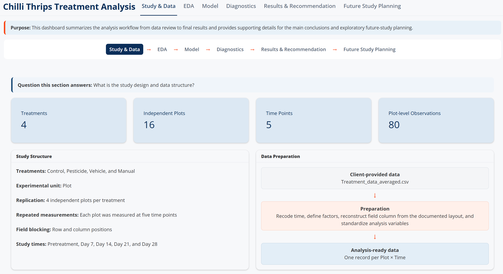
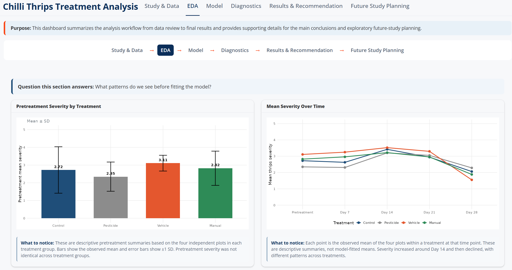
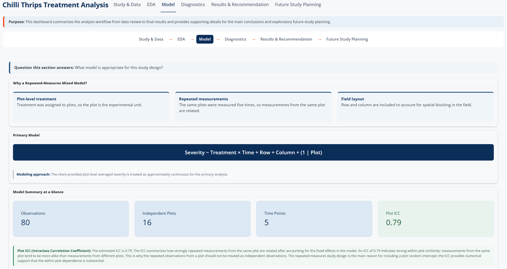
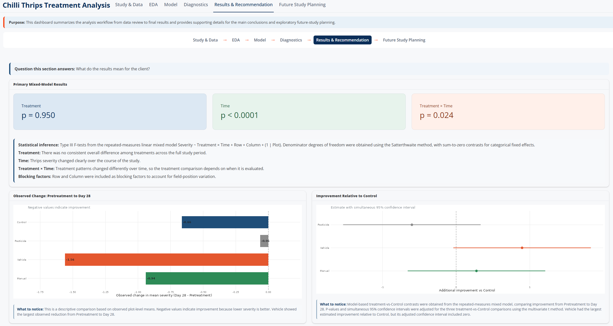
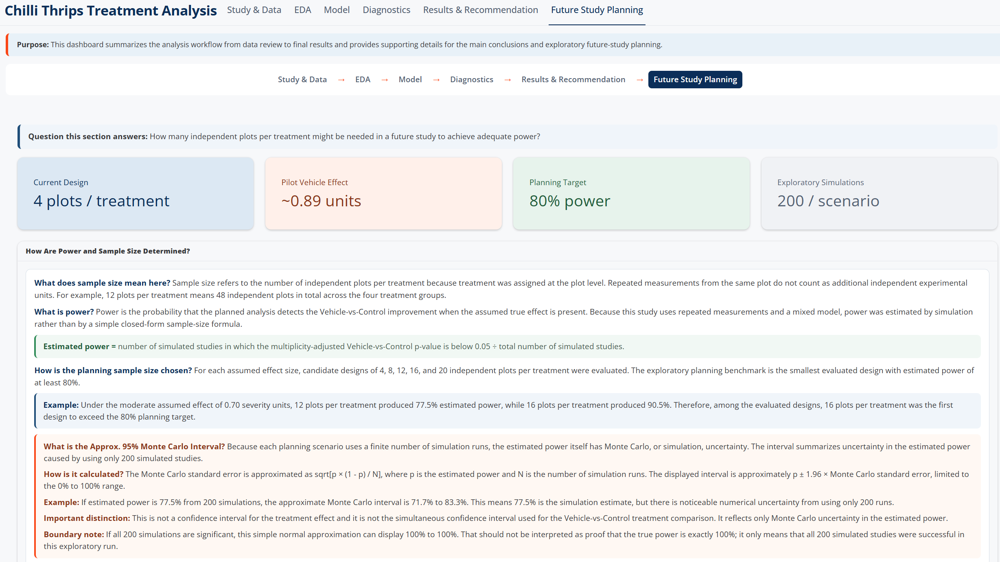
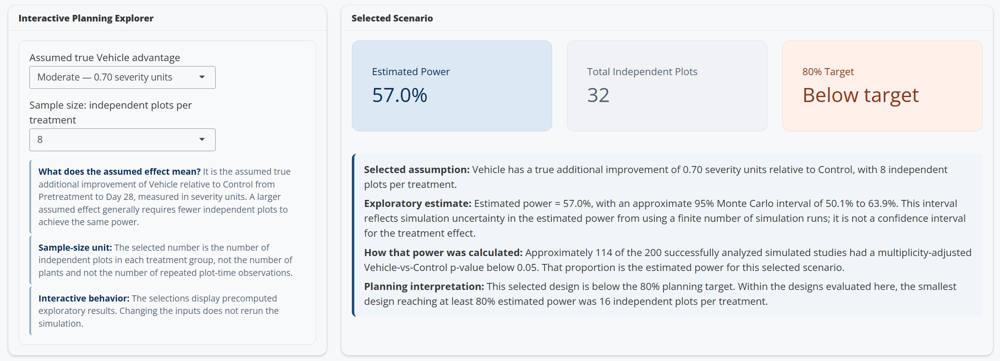
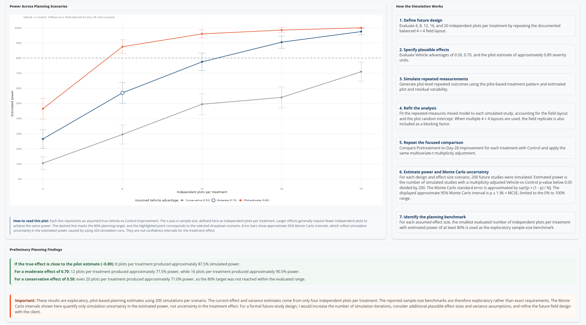

# Chilli Thrips Treatment Analysis

An interactive R Shiny dashboard for evaluating treatment effectiveness in a repeated-measures field experiment and supporting future-study planning.

## Overview

This project demonstrates an end-to-end statistical consulting workflow for comparing four chilli thrips treatments over time.

The analysis focuses on:

- Understanding the experimental design and identifying the correct experimental unit
- Exploring treatment patterns before modeling
- Fitting a repeated-measures linear mixed-effects model
- Evaluating model diagnostics
- Interpreting treatment-by-time differences
- Conducting adjusted treatment-vs-Control comparisons
- Translating statistical results into a client-focused recommendation
- Using simulation-based power analysis for exploratory future-study planning

## Interactive Dashboard

[**View Interactive Dashboard**](https://rentalsurvey.shinyapps.io/chilli-thrips-treatment-analysis/)

The live R Shiny dashboard provides additional exploratory analysis, model diagnostics, detailed treatment comparisons, and interactive future-study planning.

---

## Analysis Workflow

The dashboard follows a structured consulting workflow:

**Study & Data → EDA → Model → Diagnostics → Results & Recommendation → Future Study Planning**

### 1. Study Design & Data

The study contains four treatments, 16 independent plots, five repeated time points, and 80 plot-level observations.



### 2. Exploratory Data Analysis

Exploratory analysis examines baseline differences and how mean thrips severity changes across treatments over time.



### 3. Repeated-Measures Mixed Model

Because treatment was assigned at the plot level and the same plots were measured repeatedly over time, the primary analysis uses a mixed-effects model.



The primary model is:

`Severity ~ Treatment * Time + Row + Column + (1 | Plot)`

where:

- **Treatment** evaluates overall treatment differences
- **Time** evaluates changes during the study
- **Treatment × Time** evaluates whether treatment patterns differ over time
- **Row + Column** account for the documented field layout
- **(1 | Plot)** accounts for repeated measurements from the same plot

### 4. Results & Recommendation

The primary model found:

- **Treatment:** p = 0.950
- **Time:** p < 0.0001
- **Treatment × Time:** p = 0.024

The significant Treatment × Time interaction indicates that treatment patterns changed differently over time, so treatment comparisons depend on when they are evaluated.



A focused model-based comparison examined improvement from Pretreatment to Day 28.

Vehicle showed the largest estimated improvement relative to Control, approximately **0.89 severity units**, but the multiplicity-adjusted evidence was not definitive:

- Adjusted p-value: **0.063**
- Simultaneous 95% confidence interval: approximately **-0.04 to 1.83**

Therefore, Vehicle was identified as the **most promising treatment for further evaluation**, rather than as a confirmed winner.

---

## Future Study Planning

The dashboard also includes an exploratory simulation-based power analysis to examine how many independent plots per treatment may be needed in a future study.

Because treatment is assigned at the plot level, **sample size refers to the number of independent plots per treatment**, not the number of individual plants or repeated measurements.

### Planning Overview



The exploratory planning analysis evaluates:

- 4, 8, 12, 16, and 20 independent plots per treatment
- Several plausible Vehicle-vs-Control effect sizes
- An 80% power planning target
- 200 simulated studies per scenario

### Interactive Planning Explorer

Users can select an assumed effect size and number of independent plots per treatment to explore the corresponding precomputed power estimate.



### Power Across Planning Scenarios



The simulation results illustrate how required replication depends strongly on the assumed treatment effect.

For example:

- Under the pilot effect estimate of approximately **0.89**, 8 plots per treatment produced about **87.5%** estimated power.
- Under a moderate effect of **0.70**, 12 plots per treatment produced about **77.5%** power, while 16 plots per treatment produced about **90.5%**.
- Under a more conservative effect of **0.50**, even 20 plots per treatment produced only about **71%** estimated power.

These results are intended as **exploratory planning benchmarks**, not definitive sample-size requirements.

---

## Statistical Approach

The primary analysis uses a repeated-measures linear mixed-effects model.

The plot is treated as the experimental unit because treatments were assigned at the plot level. Repeated measurements from the same plot are therefore correlated and should not be treated as independent observations.

The workflow also includes:

- Descriptive baseline comparisons
- Treatment trajectory visualization
- Individual plot trajectories
- Mixed-model diagnostics
- Type III fixed-effect tests
- Estimated marginal means
- Treatment-vs-Control contrasts
- Multiplicity adjustment using the multivariate-t method
- Simulation-based power analysis
- Monte Carlo uncertainty for estimated power

The original severity response is an ordinal 0–4 scale. The primary analysis uses the provided plot-level averages as approximately continuous outcomes. A plant-level ordinal mixed model would be a useful sensitivity analysis when the original plant-level sampling structure is available.

---

## Tools

- R
- Shiny
- ggplot2
- lme4
- lmerTest
- emmeans
- dplyr
- tidyr
- DT

---

## Repository Structure

```text
chilli-thrips-treatment-analysis/
│
├── app.R
├── README.md
│
├── data/
│   └── Treatment_data_averaged.csv
│
└── screenshots/
    ├── study_design.png
    ├── exploratory_analysis.png
    ├── mixed_model.png
    ├── results_recommendation.png
    ├── future_study_planning_1.png
    ├── future_study_planning_2.png
    └── future_study_planning_3.png
```

## Run Locally

Clone or download the repository, open the project directory in R or RStudio, install the required packages, and run:

```r
shiny::runApp()
```

The application expects the analysis dataset to be available in the `data/` directory.

---

## Project Purpose

This project is intended to demonstrate an applied statistical consulting workflow that connects:

**study design → exploratory analysis → statistical modeling → diagnostics → interpretation → client recommendation → future-study planning**

The emphasis is not only on fitting a statistical model, but also on communicating uncertainty and translating statistical results into practical recommendations.

## Author

**Yu-Chun Wang**  
Ph.D. in Statistical Science
